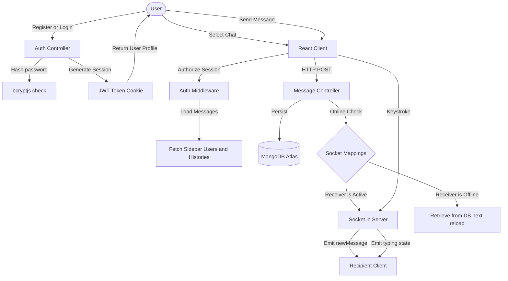

# Realtime Chat Application

A complete, production-style, responsive, and beginner-friendly full-stack chat application built using the MERN stack (MongoDB, Express, React, Node.js) and Socket.io.

GitHub Repository: https://github.com/Ayush00029/REAL-TIME-CHAT-APP

---

## Application Flow Diagram

The diagram below illustrates the authentication flow, REST API database storage, and bidirectional Socket.io real-time interactions:



---

## Tech Stack

### Frontend
- React 18 and Vite: Rapid, modern UI development.
- Tailwind CSS: Sleek styling with full dark mode support.
- Socket.io-client: Realtime events communication client.
- Lucide React: Clean UI icons.
- React Hot Toast: Beautiful micro-notifications.
- Axios: HTTP client configuration with credentials.

### Backend
- Node.js and Express.js: Backend server and REST API router.
- Socket.io: Realtime bidirectional messaging engine.
- MongoDB Atlas and Mongoose: Cloud database persistence and schema modeling.
- JWT (JSON Web Token): Cookie and Header-based secure session management.
- bcryptjs: Secure password hashing.

---

## Project Structure

```txt
chat-app/
│
├── frontend/
│   ├── src/
│   │   ├── components/  # Reusable UI fragments
│   │   ├── context/     # AuthContext, SocketContext, ChatContext
│   │   ├── pages/       # Login, Register, Dashboard (Chat view)
│   │   ├── services/    # api.js (Axios setup)
│   │   ├── index.css    # Global CSS & Tailwind setups
│   │   ├── main.jsx     # App entry
│   │   └── App.jsx      # Routes & protection layouts
│   ├── tailwind.config.js
│   └── index.html
│
└── backend/
    ├── config/          # db.js (MongoDB Connection)
    ├── controllers/     # auth, user, message logic handlers
    ├── middleware/      # protectRoute authentication gate
    ├── models/          # Mongoose models (User, Message)
    ├── routes/          # API routers
    ├── socket/          # Socket.io connection manager
    └── server.js        # Main server entrypoint
```

---

## Setup and Installation

### Prerequisite
Ensure you have Node.js (v16 or higher) and npm installed.

### Step 1: Set up the Backend
1. Navigate to the backend directory:
   ```bash
   cd backend
   ```
2. Create a `.env` file in the backend directory and set up your configurations:
   ```env
   MONGO_URI=your_mongodb_atlas_connection_string
   JWT_SECRET=your_jwt_signing_secret
   PORT=5000
   ```
3. Install dependencies:
   ```bash
   npm install
   ```
4. Start the backend server:
   ```bash
   npm run dev
   ```
   (The server will run on http://localhost:5000 and automatically connect to MongoDB Atlas).

### Step 2: Set up the Frontend
1. Navigate to the frontend directory:
   ```bash
   cd ../frontend
   ```
2. Install dependencies:
   ```bash
   npm install
   ```
3. Start the development server:
   ```bash
   npm run dev
   ```
   (The app will open on http://localhost:5173).

---

## API Testing and Integration Guide

### Authentication Ends
#### 1. Register User
- Method: `POST`
- Path: `http://localhost:5000/api/auth/signup`
- Body (JSON):
  ```json
  {
    "username": "alice",
    "email": "alice@gmail.com",
    "password": "password123"
  }
  ```
- Response: Details of the newly created user and an HttpOnly cookie named `jwt`.

#### 2. Log in User
- Method: `POST`
- Path: `http://localhost:5000/api/auth/login`
- Body (JSON):
  ```json
  {
    "email": "alice@gmail.com",
    "password": "password123"
  }
  ```

#### 3. Log out User
- Method: `POST`
- Path: `http://localhost:5000/api/auth/logout`

---

### User and Message Ends (Protected Routes)
Requires the authenticated cookie `jwt` or Bearer Token.

#### 4. Fetch All Contacts (Sidebar)
- Method: `GET`
- Path: `http://localhost:5000/api/users`

#### 5. Fetch Chat Messages
- Method: `GET`
- Path: `http://localhost:5000/api/messages/:id` (replace `:id` with the contact's User ID)

#### 6. Send Message
- Method: `POST`
- Path: `http://localhost:5000/api/messages/send/:id`
- Body (JSON):
  ```json
  {
    "text": "Hello! How have you been?"
  }
  ```

---

## Socket.io Events

The realtime connection facilitates these main event structures:
- `connection`: Triggered when the client connects. Submits the `userId` in the query to build socket mappings.
- `getOnlineUsers`: Sent to all clients on connection/disconnection changes. Sends an array of online user IDs.
- `typing`: Emitted by the client when typing. Receives payload `{ senderId, receiverId }` and forwards `userTyping` to the receiver.
- `stopTyping`: Emitted by the client when stopping typing. Forwards `userStoppedTyping` to the receiver.
- `newMessage`: Emitted by the server to push a newly created message immediately to the recipient's socket.

---

## Premium UX Features
1. **Interactive Fluid Typography**: Built using Outfit and Inter Google Fonts.
2. **Glassmorphism Theme**: Translucent, blurred forms and panels fitting both dark/light mode configurations.
3. **Sound-Effect Cues**: Generates micro-beeps using pure browser Web Audio API synth oscillators to alert incoming messages when users chat from background panels.
4. **Dynamic Active States**: Smooth CSS animations, custom scrollbars, active online green rings, and pulsing loading skeletons.
5. **Social Referral System (Invite Friends)**: Direct sharing links (integrated with WhatsApp Web & Mail drafts) with referral URL parameter parsing (?invitedBy=username) to show personalized onboarding banners.
6. **100% Offline-Safe Avatars**: Client-side SVG generator for custom initials and emoji presets, removing external third-party API dependencies.
